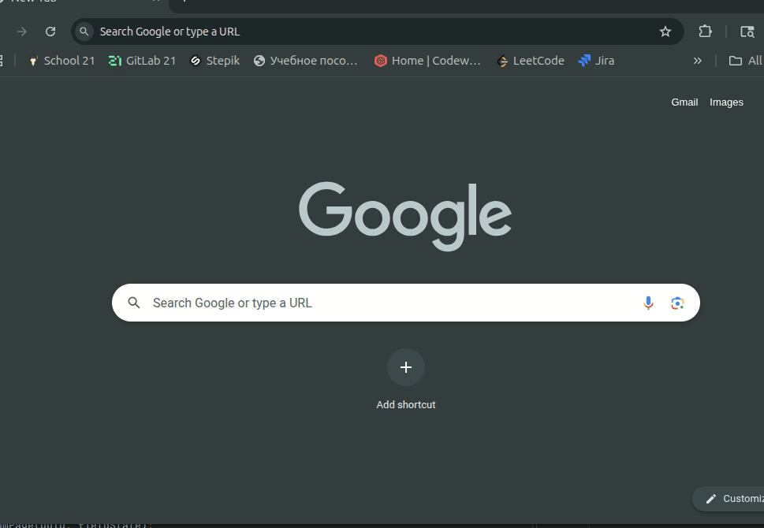

# Project - TicTacToe-WebApplication

Веб-приложение "Крестики-Нолики v1.0" реализовано на основе фреймворка Spring и демонстрирует принципы многослойной архитектуры, внедрения зависимостей и модульного проектирования.

## Инструкция по запуску

 * Вы можете запустить приложение через докерфайл, который находится в корне проекта. Для этого в корне проекта нужно запустить скрипт *run.sh* `sh run.sh`. Либо вручную сбилдить образ и запустить контейнер, при этом важно указать порты для маппинга (по умолчанию используется **порт 8080**)
 * Другой вариант запуска - открыть проект в IntelliJ IDEA и нажать на кнопку билда.

    

## Общая информация
Веб-приложение — клиент-серверное приложение, где клиент (браузер) взаимодействует с сервером по сети.

Приложение поддерживает несколько игр одновременно.

* Язык: Java
* Система сборки: Gradle
* Версия языка: JDK 21
* Gradle DSL — Kotlin
* Spring Boot
* Spring MVC
* Thymeleaf

## Описание слоев
### Domain
* Описывает бизнес-логику и модели (игровое поле как целочисленная матрица, текущая игра с UUID).
* Интерфейс сервиса реализует:
  * Получение следующего хода по алгоритму «Минимакс»
  * Валидацию игрового поля (сравнивется текущее игровое поле с полем из репозитория)
  * Проверку окончания игры

### Datasource
* Отвечает за хранение и доступ к данным (игры).
* Использует потокобезопасную коллекцию для хранения (в следующих версиях будет БД Postgres).
* Реализует репозиторий и мапперы между domain и datasource.

### Web
* Описывает модели для взаимодействия с клиентом и мапперы между domain и web.
* Контроллер Spring с методами **GET** и **POST**, который работает с ендпоинтом `/game`

### DI
* Описывается конфигурация Spring в классе `ProjConfig.java`

